Newsroom
========

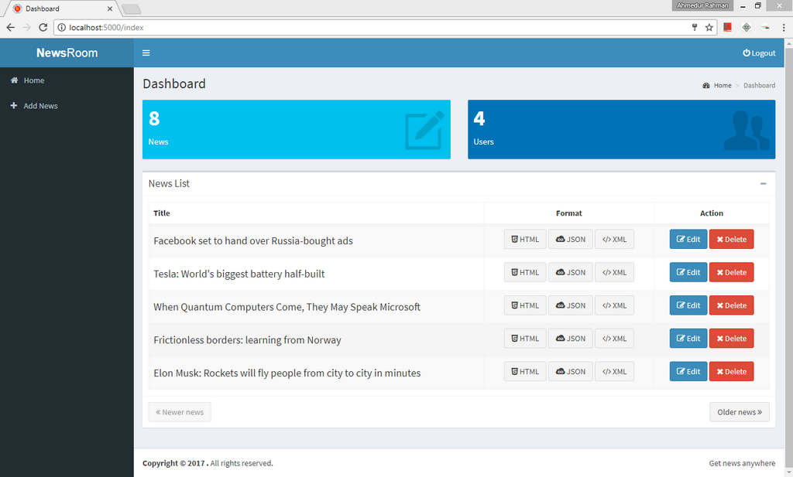

A web application for storing and managing news stories.

## Milestones

### - [x] Phase 1 (Completed)

   - Necessary package installation
   
   - Database creation
   
   - Sign up and login system for users

   - A page to list all stored news

   - A page to create new news

### - [x] Phase 2 (Completed)

   - Add JSON format for each news

   - Update story list page to include JSON link

### - [x] Phase 3 (Completed)
 
   - Add date field in news form

   - Modify database design
   
   - Add XML format for each news

   - Update story list page to include XML link

### - [x] Phase 4 (Completed)

   - Add edit and delete functinoalities for each news

   - Delete function should include confirmation alert
   
## Software Requirements

The following environment are used to develop the application:

- **OS** : Windows 8.1 (64 bit)
- **IDE** : PyCharm Professional (Version: 2017.2.3)
- **Server** : XAMPP (Version 3.2.2)
- **Python** : 3.6.2 (64 bit)
- **MySQL** : 10.1.21-MariaDB

### Necessary Package Installation

- Install virtual environment

		$ python -m venv newsroom_venv

- Activate virtual environment (Change it based on your OS)

		$ newsroom_venv\Scripts\activate.bat

- Install necessary packages included in requirements.txt

		$ pip install -r webapp\requirements.txt

In CMD, the above commands are executed like below:

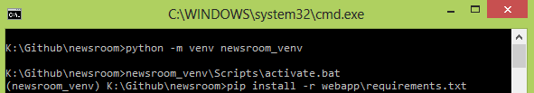		
		
### Database Configuration

- Open CMD/Terminal/X-term and login as mysql root user. 
Then create a database user `newsroom_db_admin` with password `newsroom_db_password`, 
main database, test database and grant all privileges to the user as shown below:

```
$ mysql -u root
mysql> CREATE USER 'newsroom_db_admin'@'localhost' IDENTIFIED BY 'newsroom_db_password';
mysql> CREATE DATABASE newsroom_db;
mysql> GRANT ALL PRIVILEGES ON newsroom_db . * TO 'newsroom_db_admin'@'localhost';
mysql> CREATE DATABASE newsroom_test_db;
mysql> GRANT ALL PRIVILEGES ON newsroom_test_db . * TO 'newsroom_db_admin'@'localhost';
```

This may look like this

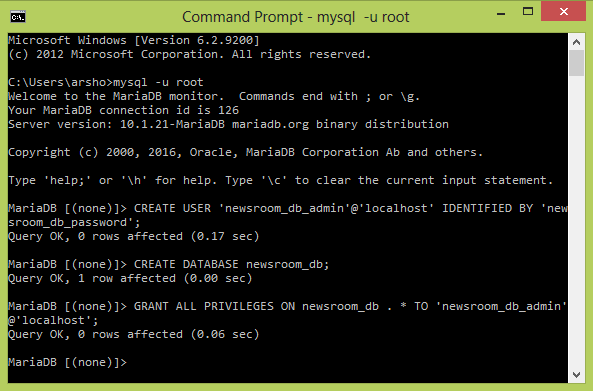		
		
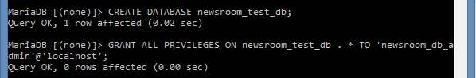				
		
- Activate virtual environment (if not activated)

		$ newsroom_venv\Scripts\activate.bat

- Change directory to webapp

		$ cd webapp

- Check MySQL configuration in `config.py` using own MySQL username, password and database name. 

- Check test MySQL configuration in `tests.py` using own MySQL username, password and database name. 

- To create the database run `db_create.py`. Run only after first configuration. 

		$ python db_create.py

- To track down the schema changes of database, I have used migration technique.
Execute `db_upgrade.py` to upgrade the database to the latest revision. 
This script should run after every modification in database schema.

		$ python db_migrate.py

The relationship between table looks like below in phpMyAdmin

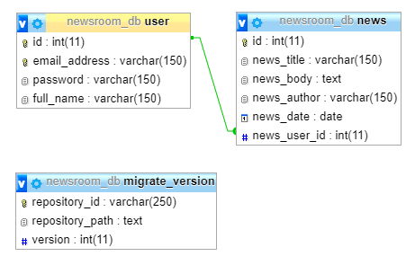		

		
### To Run the Application

- Activate virtual environment (if not activated)

		$ newsroom_venv\Scripts\activate.bat

- Run the `application.py`

		$ python application.py

		
### Unit testing

- Ensure that you have created test database as mentioned above

- Activate virtual environment (if not activated)

		$ newsroom_venv\Scripts\activate.bat

- Run the `tests.py`

		$ python tests.py

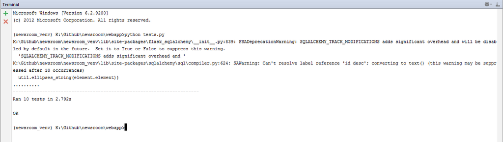		
		
### What is this repository for?

- Quick summary
- Version Controlling
- Screenshot enlisting of each phase (See attached Screenshot folder)
- [Issue Tracking](https://bitbucket.org/arsho/newsroom/issues)


### Phase 1 Output

- Registration page for new user

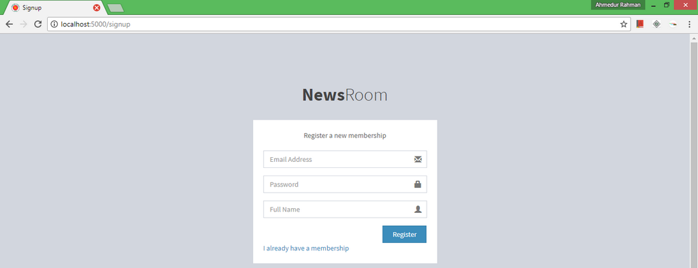

- Login page for existing user

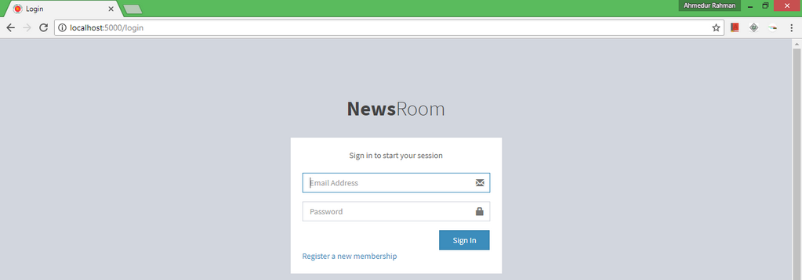

- Home page for logged in user

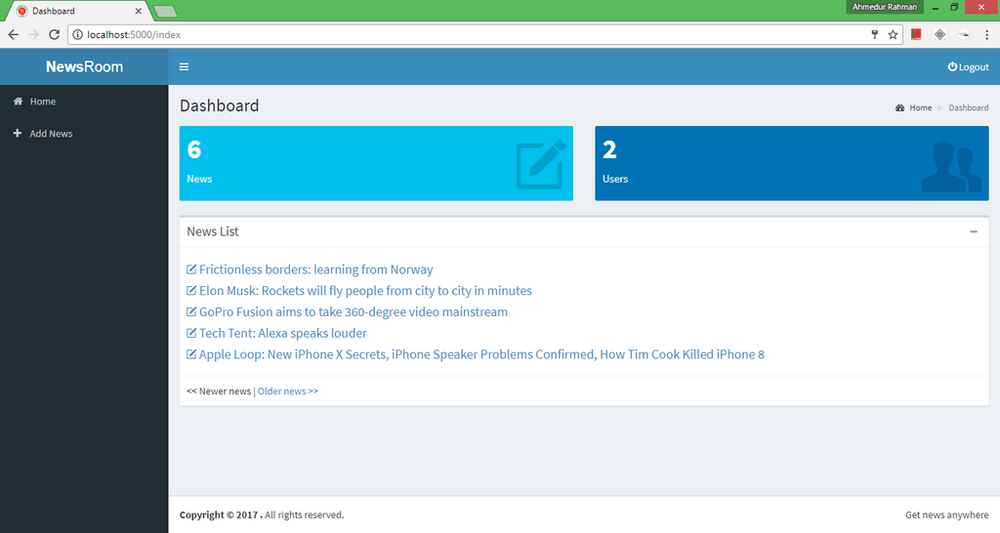

- Add news page for adding new news to database

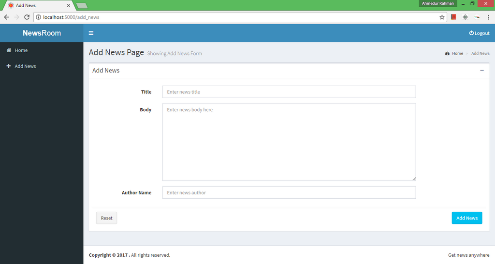

- News details page for single news

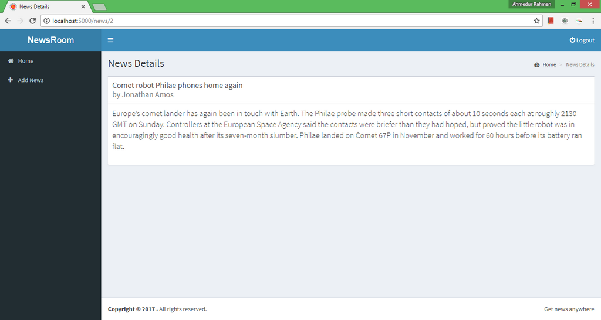

- XSS check in address bar using custom error page

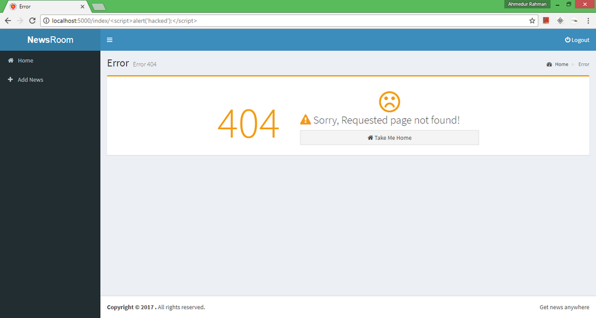

- Database table from phpMyAdmin

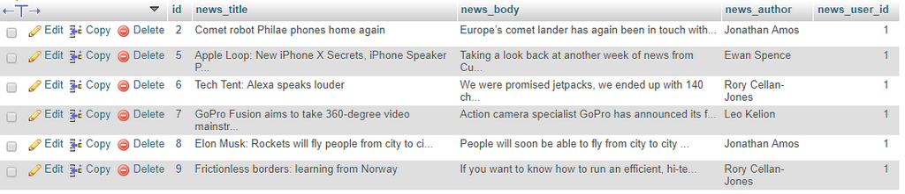

### Phase 2 Output

- Sample news in HTML format

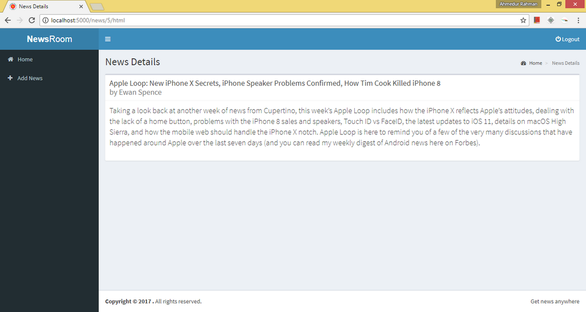

- Sample news in JSON format

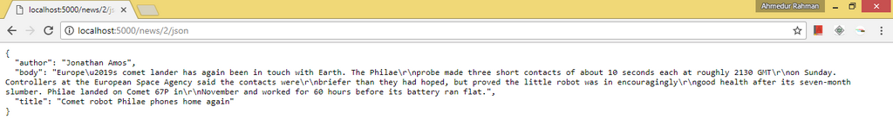


### Phase 3 Output

- Listing the news with both HTML, JSON and XML format with pagination

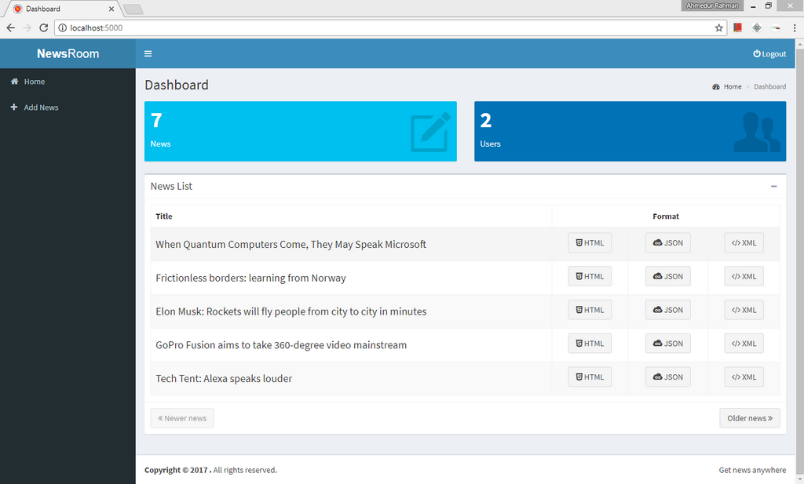

- Added date in add news form. 
Updated the model and then migrated the database using `python db_migrate.py` inside the virtual environment.

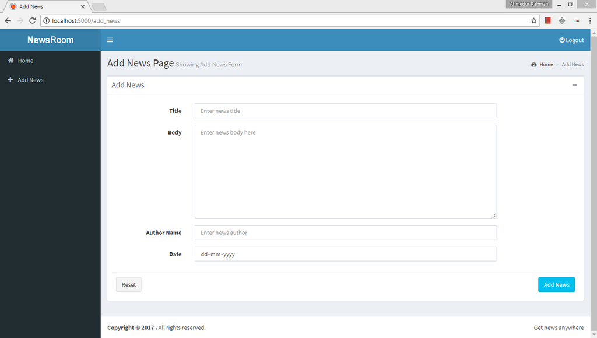

- Sample news in HTML format with date

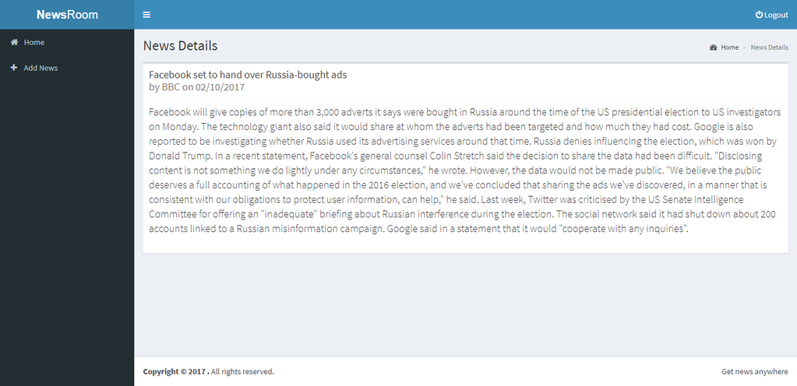

- Sample news in XML format

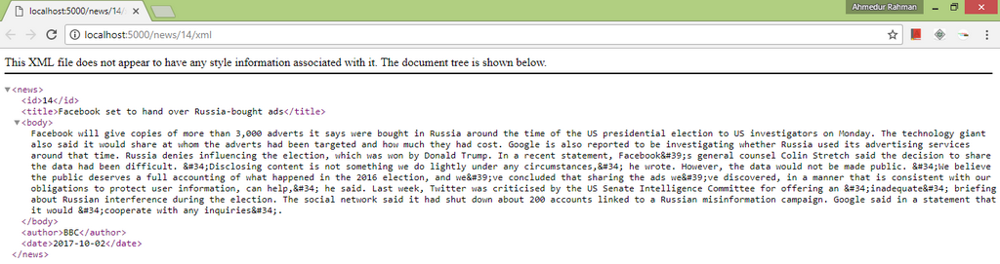

- Dashboard can be accessible with or without login. But to add news login is mandatory.

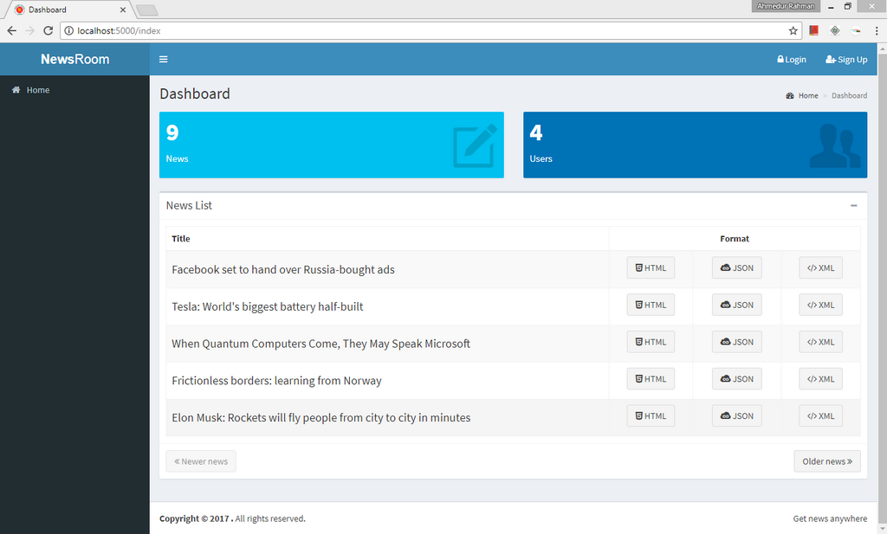

- Strong validation in applied all forms. Here is an example of registration form validation.

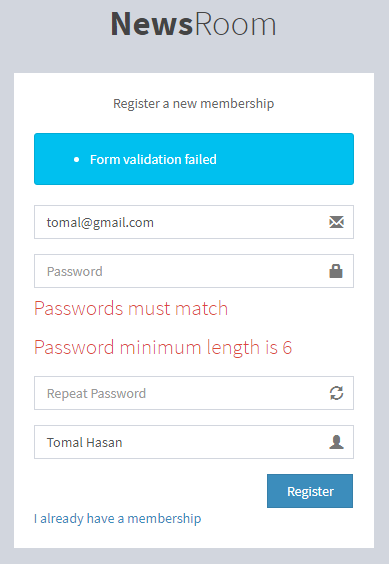

### Phase 4 Output

- Listing the news with both HTML, JSON and XML format with pagination and edit and delete functionalities


- Edit option of a news.

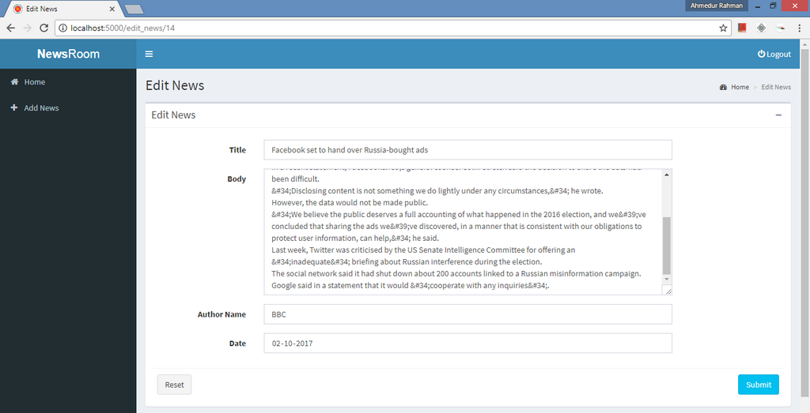

- Delete news after confirmation

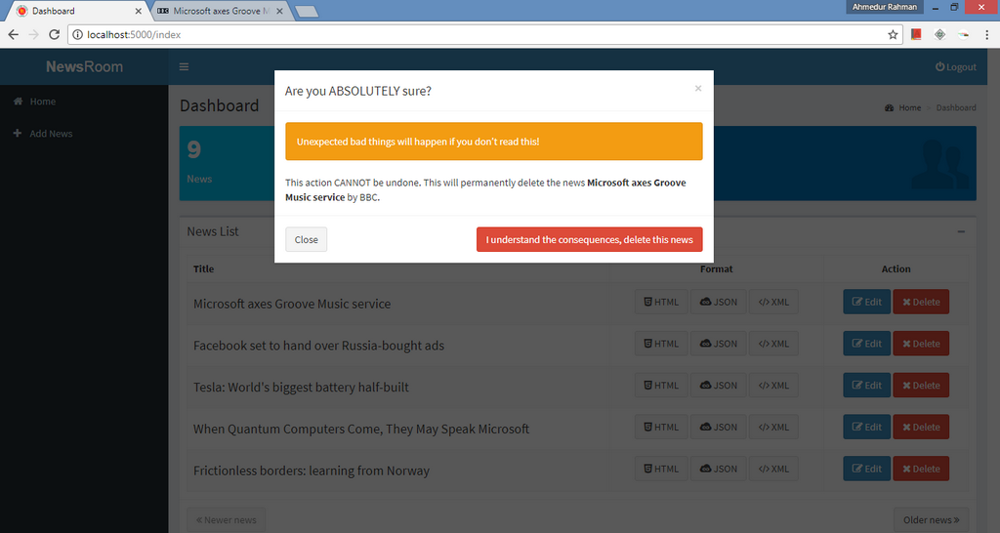